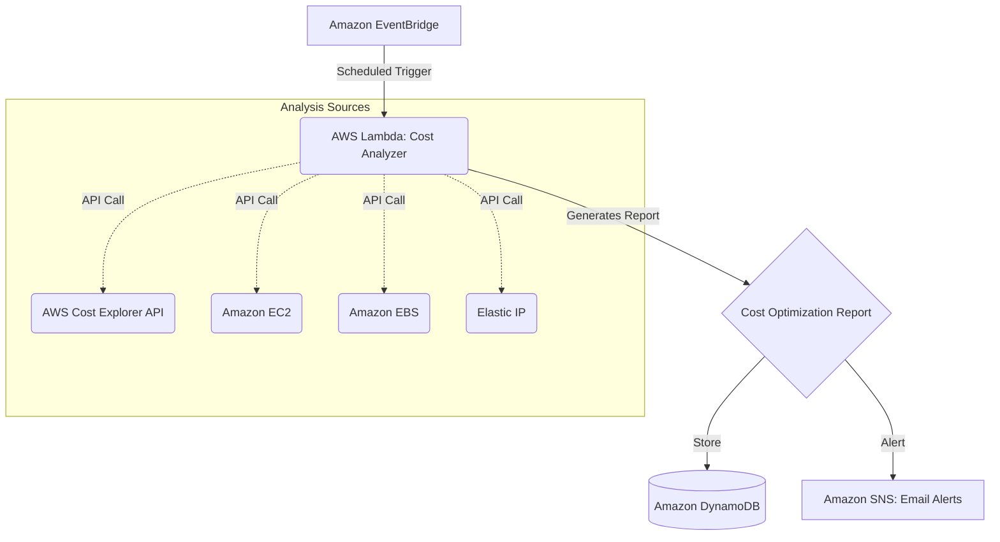

# Cloud Cost Optimization Platform

A serverless AWS application designed to analyze cloud resource usage, identify potential cost savings, and generate comprehensive reports. It continuously monitors AWS resources to prevent cost leaks from unattached or underutilized resources.

## Architecture



## Features
- **Automated Scanning**: Triggered periodically by Amazon EventBridge.
- **Resource Analysis**:
  - Checks AWS Cost Explorer for general spending trends.
  - Identifies stopped EC2 instances that can be terminated.
  - Finds unattached EBS volumes wasting money.
  - Highlights unassociated Elastic IPs that incur charges.
- **Reporting & Storage**: Saves detailed optimization reports in DynamoDB.
- **Alerts**: Notifies administrators via Amazon SNS (Email/SMS) with potential savings.

## Prerequisites
- AWS CLI configured with appropriate permissions.
- AWS SAM CLI installed.
- Python 3.9+ installed.

## Deployment

1. Build the SAM application:
   ```bash
   sam build
   ```

2. Deploy to your AWS Account:
   ```bash
   sam deploy --guided
   ```
   Follow the prompts to configure your stack name, region, and parameters.

## Directory Structure

```text
.
├── src/
│   └── cost_analyzer/          # Lambda function code
│       ├── app.py              # Main logic
│       └── requirements.txt    # Python dependencies
├── template.yaml               # AWS SAM architecture template
└── README.md                   # Project documentation
```

## Setup Email Subscriptions

After deploying the stack, manually subscribe your email address to the created SNS Topic (`CostOptimizationAlerts`) in the AWS Console to start receiving reports.

## Tech Stack

- **Compute**: AWS Lambda
- **Database**: Amazon DynamoDB
- **Messaging/Alerting**: Amazon SNS
- **Event Management**: Amazon EventBridge
- **AWS APIs & Services**: AWS Cost Explorer API, Amazon EC2, Amazon EBS, Elastic IPs
- **Framework**: AWS Serverless Application Model (SAM)
- **Programming Language**: Python 3.9 (`boto3`)

## Author

**Vaibhav Sudrik**
- **Email**: [vaibhavsudrik2005@gmail.com](mailto:vaibhavsudrik2005@gmail.com)
- **Education**: BSc Cloud Computing

## License

MIT License
