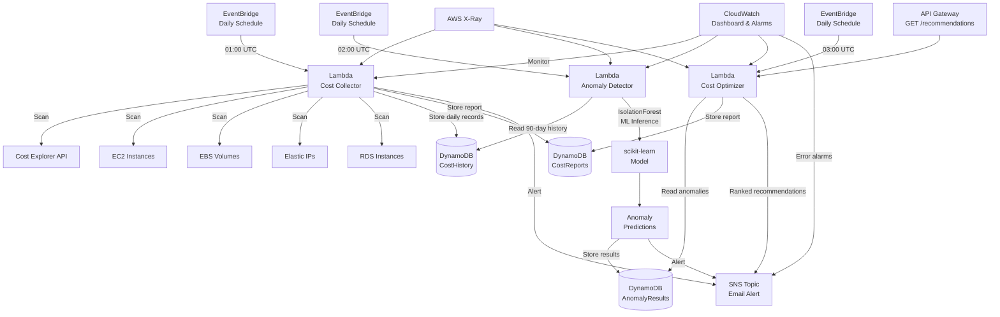

# 🚀 Cloud Cost Optimization & Anomaly Detection Platform v2

<div align="center">


A **serverless, ML-powered** cloud cost monitoring platform that automatically detects spending anomalies, identifies wasted resources, and delivers actionable, prioritised cost-saving recommendations — all without any manual review.

</div>

---

## 📌 What's New in v2

| Feature | v1 (Original) | v2 (Upgraded) |
|---|---|---|
| Lambda functions | 1 monolithic | 3 specialised (Collector → Detector → Optimizer) |
| ML anomaly detection | ❌ None | ✅ **Isolation Forest** (scikit-learn) |
| Cost granularity | Monthly | **Daily per-service** |
| DynamoDB tables | 1 (reports only) | 3 (history + reports + anomalies) |
| Resources scanned | EC2, EBS, EIP | EC2, EBS, EIP, **RDS** |
| API Gateway | ❌ | ✅ On-demand recommendations endpoint |
| CloudWatch Dashboard | ❌ | ✅ Full observability dashboard |
| CloudWatch Alarms | ❌ | ✅ Lambda error alarms |
| X-Ray tracing | Basic | **Active** on all Lambdas |
| IAM policies | Broad | **Least-privilege per function** |
| SNS alert quality | Basic text | **Structured, severity-ranked alerts** |
| Python runtime | 3.9 | **3.12** |
| DynamoDB TTL / PITR | ❌ | ✅ Auto-expire old records + point-in-time recovery |

---

## 🏗️ Architecture



---

## 📁 Project Structure

```
.
├── src/
│   ├── cost_collector/          # Lambda 1 — Daily cost data ingestion
│   │   ├── app.py               # Cost Explorer + EC2/EBS/EIP/RDS scanning
│   │   └── requirements.txt     # boto3
│   │
│   ├── anomaly_detector/        # Lambda 2 — ML anomaly detection
│   │   ├── app.py               # Isolation Forest inference on 90-day history
│   │   └── requirements.txt     # boto3, scikit-learn, numpy, scipy
│   │
│   └── cost_optimizer/          # Lambda 3 — Recommendation engine + API
│       ├── app.py               # Prioritised recommendations with checklists
│       └── requirements.txt     # boto3
│
├── template.yaml                # AWS SAM infrastructure template
├── samconfig.toml               # SAM deployment configuration
├── .gitignore
└── README.md
```

---

## ⚙️ How It Works

### Lambda 1 — Cost Collector (runs at 01:00 UTC)
1. Calls **Cost Explorer API** with `DAILY` granularity, grouped by `SERVICE`.
2. Stores **90 days of per-service daily records** in `CostHistory` DynamoDB table.
3. Simultaneously scans **EC2, EBS, EIP, RDS** for wasted resources.
4. Saves an optimization report and sends an SNS collection summary.

### Lambda 2 — Anomaly Detector (runs at 02:00 UTC)
1. Loads the last **90 days** of records from the `CostHistory` table.
2. For each AWS service with ≥14 data points:
   - Builds a **feature matrix**: `[cost, usage, day_of_week, month, log(cost), rolling_deviation]`
   - Fits an **Isolation Forest** (`n_estimators=200`, `contamination=5%`)
   - Identifies anomalous days (IF prediction = `-1`)
3. Classifies each anomaly as `CRITICAL / HIGH / MEDIUM / LOW` by score.
4. Generates a **service-specific recommendation** for each anomaly.
5. Persists all results to `AnomalyDetectionResults` and fires an SNS alert.

### Lambda 3 — Cost Optimizer (runs at 03:00 UTC + API)
1. Reads recent anomaly records from DynamoDB.
2. Groups anomalies by service and estimates **potential monthly savings**.
3. Generates a **prioritised checklist** of concrete remediation actions.
4. Returns recommendations via the **API Gateway endpoint**.
5. Publishes a ranked recommendations alert to SNS.

---

## 🔧 Prerequisites

- **AWS CLI** configured (`aws configure`)
- **AWS SAM CLI** installed — [Install guide](https://docs.aws.amazon.com/serverless-application-model/latest/developerguide/install-sam-cli.html)
- **Python 3.12** installed locally
- IAM user/role with permissions for: Lambda, DynamoDB, SNS, EventBridge, API Gateway, Cost Explorer, CloudWatch, X-Ray

---

## 🚀 Deployment

### 1. Clone the repository
```bash
git clone https://github.com/vaibhav343343/Cloud-Cost-Optimization-Anomaly-Detection-Platform.git
cd Cloud-Cost-Optimization-Anomaly-Detection-Platform
```

### 2. Build (installs Python dependencies per Lambda)
```bash
sam build
```

### 3. Deploy (first time — guided)
```bash
sam deploy --guided
```

You will be prompted for:
| Parameter | Description | Example |
|---|---|---|
| `Stack name` | CloudFormation stack name | `cloud-cost-platform` |
| `AWS Region` | Target region | `us-east-1` |
| `AlertEmail` | Email for SNS alerts | `you@example.com` |
| `Environment` | Stage tag | `production` |
| `CollectionSchedule` | EventBridge schedule | `rate(1 day)` |
| `IFContamination` | Isolation Forest contamination | `0.05` |

### 4. Subsequent deploys
```bash
sam build && sam deploy
```

### 5. Check deployed resources
```bash
aws cloudformation describe-stacks \
  --stack-name cloud-cost-platform \
  --query "Stacks[0].Outputs"
```

---

## 📊 API Endpoint

After deployment, retrieve the API URL from outputs:
```bash
aws cloudformation describe-stacks \
  --stack-name cloud-cost-platform \
  --query "Stacks[0].Outputs[?OutputKey=='CostOptimizerApiUrl'].OutputValue" \
  --output text
```

**GET** `https://<api-id>.execute-api.<region>.amazonaws.com/production/recommendations`

Example response:
```json
{
  "OptimizerRunId": "c3f8a...",
  "TotalPotentialSavingsUSD": 342.50,
  "PriorityBreakdown": {"CRITICAL": 1, "HIGH": 2, "MEDIUM": 3, "LOW": 1},
  "Recommendations": [
    {
      "service": "Amazon EC2",
      "priority": "CRITICAL",
      "estimated_monthly_savings": 180.00,
      "action": "Unusual EC2 spend ($247.80). Check for forgotten instances...",
      "actions_checklist": [
        "Open EC2 console → check for stopped or idle instances.",
        "Review CloudWatch CPU utilization metrics (target >20% avg).",
        ...
      ]
    }
  ]
}
```

---

## 📈 CloudWatch Dashboard

After deployment, view the dashboard at:
```
https://<region>.console.aws.amazon.com/cloudwatch/home?region=<region>#dashboards:name=CostOptimizationPlatform-production
```

The dashboard shows:
- Lambda invocations, errors, duration for all 3 functions
- DynamoDB read/write capacity for all tables
- SNS messages published & delivered

---

## 🛡️ Security & IAM

Each Lambda function has **least-privilege IAM policies**:

| Function | Permissions |
|---|---|
| CostCollector | `ce:GetCostAndUsage`, `ec2:Describe*` (read-only), `rds:Describe*`, DynamoDB CRUD (2 tables), SNS publish |
| AnomalyDetector | DynamoDB read (history), DynamoDB CRUD (anomalies), SNS publish |
| CostOptimizer | DynamoDB read (anomalies), DynamoDB CRUD (reports), `ce:GetCostAndUsage`, SNS publish |

---

## 💡 ML Model Details

| Parameter | Value |
|---|---|
| Algorithm | **Isolation Forest** (sklearn.ensemble) |
| Estimators | 200 trees |
| Contamination | 5% (configurable via `IFContamination` parameter) |
| Training window | 90 days rolling |
| Features | `cost_usd`, `usage_qty`, `day_of_week`, `month`, `log(cost)`, `rolling_7d_deviation` |
| Preprocessing | `StandardScaler` (zero mean, unit variance) |
| Minimum samples | 14 days per service before running inference |
| Re-training | Daily (model is re-trained fresh each run — no model persistence needed at this scale) |

---

## 📬 SNS Alert Examples

### Cost Collection Alert
```
============================================================
  AWS Cost Optimization — Daily Collection Report
============================================================
  Report ID : 9f3b...
  Potential Monthly Savings : $47.60
  Stopped EC2 Instances : 3
  Unattached EBS Volumes: 2
  Idle Elastic IPs      : 1
  Stopped RDS Instances : 0
============================================================
```

### Anomaly Alert
```
================================================================
  ⚠️  AWS COST ANOMALY ALERT  ⚠️
================================================================
  Anomalies : 4
  🔴 CRITICAL : 1   🟠 HIGH : 2   🟡 MEDIUM : 1   🟢 LOW : 0
  
  [CRITICAL ] Amazon EC2                           $   247.80  (2025-06-20)
    → Unusual EC2 spend ($247.80). Check for forgotten instances...
================================================================
```

---

## 🧹 Teardown

```bash
sam delete --stack-name cloud-cost-platform
```

> **Note:** DynamoDB tables have `DeletionPolicy: Retain` — they will NOT be deleted automatically to protect historical data.

---

## 👤 Author

**Vaibhav Sudrik**
- 📧 [vaibhavsudrik2005@gmail.com](mailto:vaibhavsudrik2005@gmail.com)
- 🎓 BSc Cloud Computing

## 📄 License

MIT License — see [LICENSE](LICENSE) for details.
